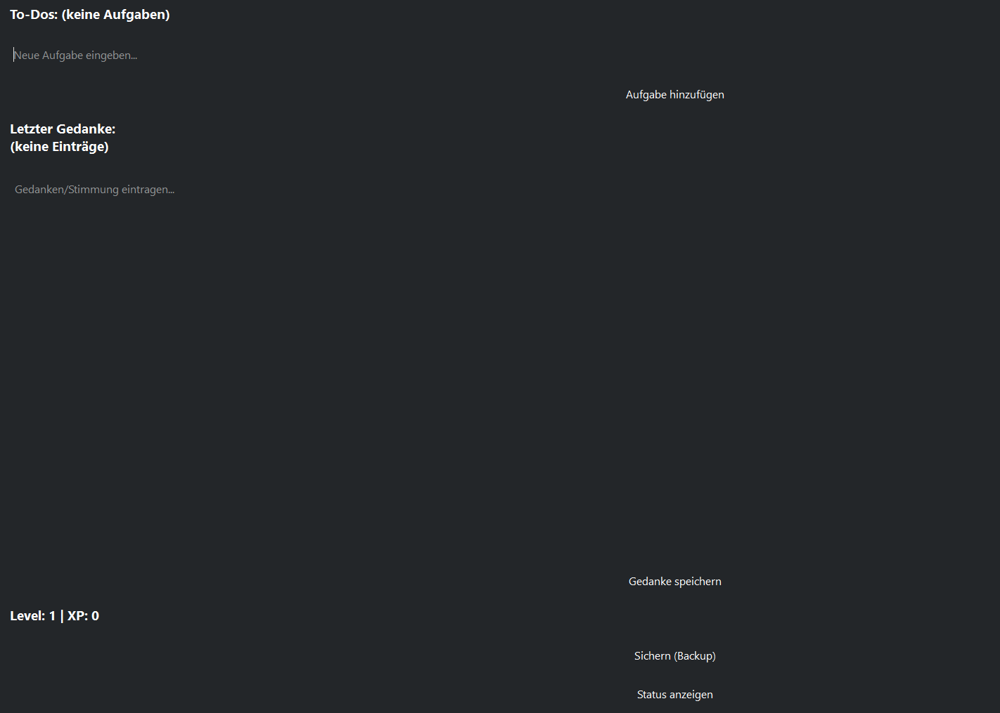

# 🧠 Virtuelles Leben

**Virtuelles Leben** ist eine moderne Desktop-Anwendung in Python (PyQt5), mit der du deine Gedanken, Stimmungen und Aufgaben einfach verwalten kannst.  
Ein integriertes XP- und Levelsystem motiviert dich spielerisch zu mehr Selbstreflexion und Produktivität.

---

## Badges


## 🚀 Features

- 🌑 **Modernes Dark Theme**
- 📝 **Tagebuch für Gedanken & Stimmung**
- ✅ **To-Do-Listen mit Prioritäten**
- 📈 **Level- und XP-System**: Sammle Erfahrungspunkte für Aktionen
- 💾 **Automatisches Backup** deiner Daten
- 📊 **Statusübersicht** zu Fortschritt, Aufgaben & Einträgen
- 🔒 **Lokale Speicherung** (keine Cloud, volle Datenkontrolle)

---

## 🖼️ Screenshots


```

---

## 🛠️ Tech Stack

- **Sprache:** Python 3.8+
- **GUI:** [PyQt5](https://pypi.org/project/PyQt5/)
- **Datenhaltung:** Lokale JSON-Dateien
- **Design:** Eigenes Dark Theme via Qt-Palette

---

## 🔧 Installation

### 1. Voraussetzungen

- Python 3.8 oder neuer
- Empfohlen: Virtuelle Umgebung nutzen

### 2. Abhängigkeiten installieren

```bash
pip install -r requirements.txt
```

*(Falls keine `requirements.txt` vorhanden ist:)*

```bash
pip install PyQt5
```

### 3. Anwendung starten

```bash
python main.py
```

---

## ℹ️ Hinweise

- Deine Daten werden ausschließlich lokal gespeichert.
- Für Backups wird automatisch ein Sicherungsordner angelegt.
- Bei Fragen oder Problemen: [Issues öffnen]()

---

## Lizenz

Dieses Projekt ist unter der MIT-Lizenz lizenziert — siehe [LICENSE](main/LICENSE) für Details.


Viel Spaß beim Ausprobieren! 🚀
